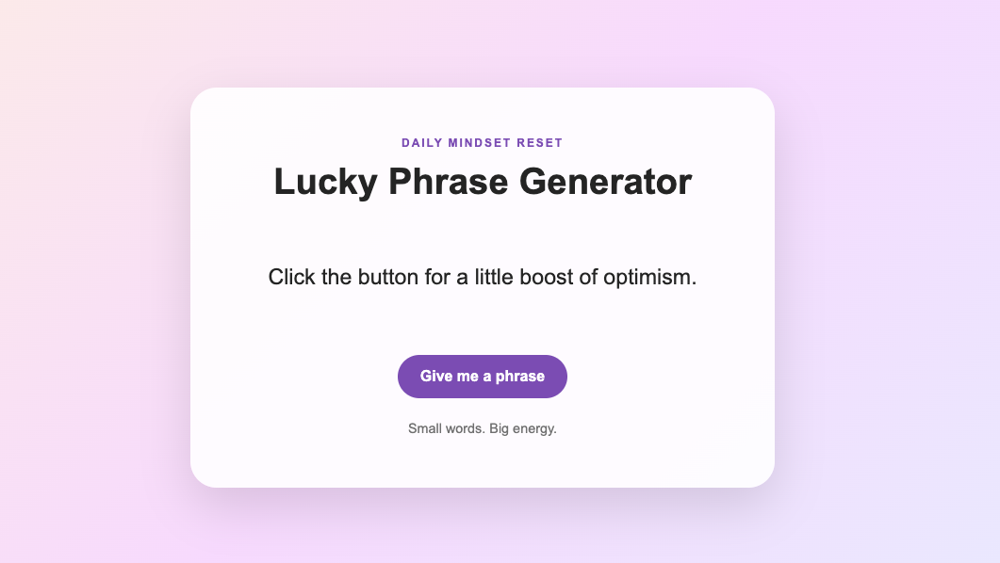

# Lucky Phrase Generator

## Overview

Lucky Phrase Generator is a tiny static web app that displays random phrases focused on good luck, motivation, optimism, prosperity, confidence, and success mindset.

This is a small beginner-friendly JavaScript project designed to practice:

- HTML structure
- CSS styling
- JavaScript arrays
- Random selection logic
- DOM updates
- Button click events

---

## How It Works

The app stores a list of motivational phrases in a JavaScript array.

When the user clicks the button, JavaScript:

1. Picks a random index from the array
2. Retrieves the phrase at that index
3. Updates the page with the selected phrase

---

## Project Structure

```text
lucky-phrase-generator/
│
├── screenshots
├── index.html
├── styles.css
├── script.js
├── README.md
└── .gitignore
```

---

## Screenshot



---

## How to Run

Open `index.html` in a browser.

No installation required.

---

## Concepts Practiced

### JavaScript Array

```js
const phrases = [
  "Good things are already on their way.",
  "You are capable of figuring this out."
];
```

### Random Number

```js
Math.floor(Math.random() * phrases.length)
```

### DOM Update

```js
phraseElement.textContent = selectedPhrase;
```

### Button Click Event

```js
button.addEventListener("click", showRandomPhrase);
```

---

## Future Improvements

- Add phrase categories
- Add animations
- Add a copy-to-clipboard button
- Add a daily phrase feature
- Add local storage for favorite phrases
- Convert to a React app
- Connect to external API to fetch dynamically
