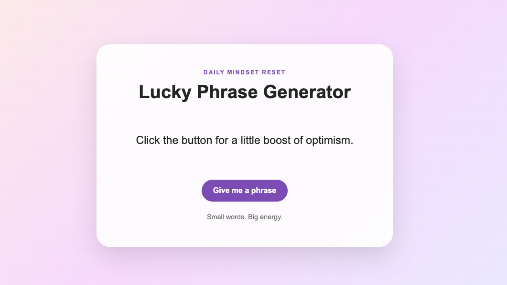
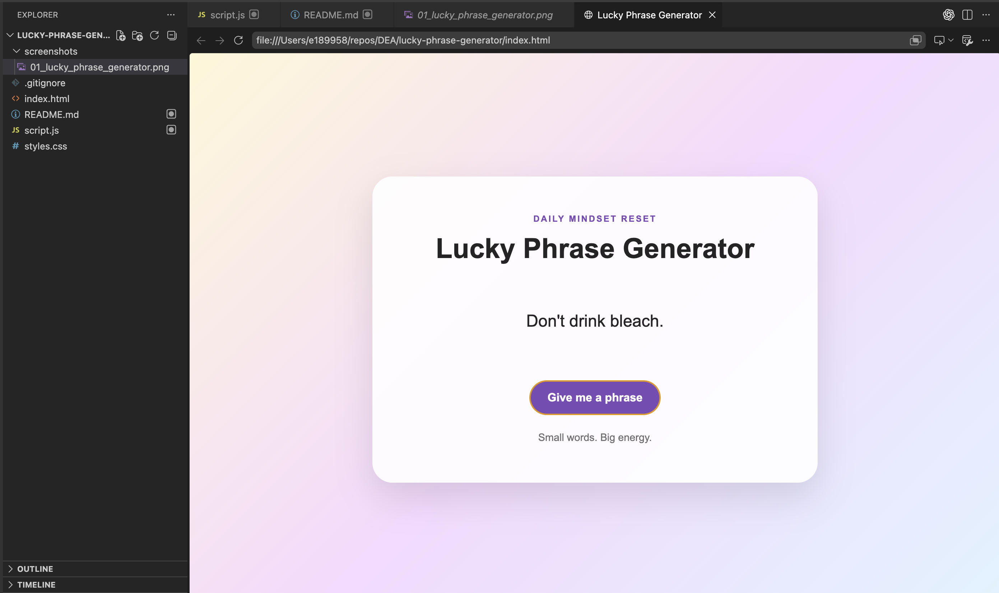

# Lucky Phrase Generator

## Overview

Lucky Phrase Generator is a tiny web app that fetches random motivational advice from an external API and displays it on the page.

This is a small but very entertaining JavaScript project designed to practice:

- HTML structure
- CSS styling
- Async/await and fetch API
- API integration
- Error handling & fallback logic
- JavaScript arrays and random selection
- DOM updates
- Button click events

---

## How It Works

The app connects to the Advice Slip API to fetch random motivational advice.

When the user clicks the button or presses Enter/Space, JavaScript:

1. Attempts to make an async request to the Advice Slip API
2. Parses the JSON response
3. Extracts the advice text
4. Updates the page with the fetched advice
5. **If the API fails**, falls back to selecting a random phrase from a local array using JavaScript array indexing and `Math.random()`
6. Triggers confetti celebration when advice (API or fallback) successfully displays

### Fallback Logic

The app maintains a curated array of 70+ motivational phrases as a fallback. If the API is unavailable or fails, a random phrase from this local array is displayed instead, ensuring the app always provides motivation!

### Keyboard Shortcuts

For a faster, more interactive experience, you can trigger a new phrase using:
- **Click** the "Give me a phrase" button
- **Press Enter** on your keyboard
- **Press Space** on your keyboard

### Confetti Celebration

Every time a new phrase successfully loads, confetti particles celebrate your moment of inspiration! 🎉

---

## Project Structure

```text
lucky-phrase-generator/
│
├── screenshots
├── index.html
├── styles.css
├── script.js
├── README.md
└── .gitignore
```

---

## Screenshots

**Original Version (Static Phrases):**


**Current Version (Dynamic API):**


---

## How to Run

Open `index.html` in a browser.

No installation required.

---

## Concepts Practiced

### Fetch API

```js
const response = await fetch("https://api.adviceslip.com/advice");
const data = await response.json();
```

### Async/Await

```js
async function showRandomPhrase() {
  // Function waits for the API response
}
```

### JavaScript Array (Fallback)

```js
const fallbackPhrases = [
  "Good things are already on their way.",
  "You are capable of figuring this out."
];
```

### Random Selection from Array

```js
function getRandomFallbackPhrase() {
  const randomIndex = Math.floor(Math.random() * fallbackPhrases.length);
  return fallbackPhrases[randomIndex];
}
```

### Error Handling with Fallback

```js
try {
  // Try to fetch the advice
} catch (error) {
  // Fall back to local random phrase
  const fallbackPhrase = getRandomFallbackPhrase();
  phraseElement.textContent = fallbackPhrase;
}
```

---

## Future Improvements

- Add phrase categories
- Add animations
- Add a copy-to-clipboard button
- Add a daily phrase feature
- Add local storage for favorite phrases
- Convert to a React app
- ✅ Connect to external API to fetch dynamically (Done!)
- ✅ Confetti celebration effect (Done!)
