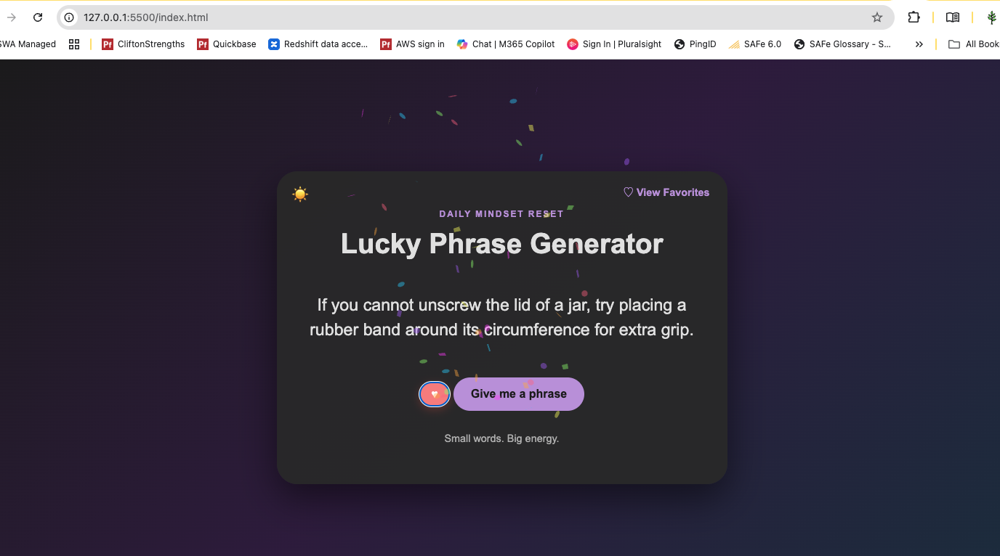

# Lucky Phrase Generator

## Overview

Lucky Phrase Generator is a demonstration web application that showcases modern JavaScript development practices, including API integration, state management, testing, and UI/UX design patterns. The application fetches random quotes and advice from multiple external APIs while maintaining local fallback content, providing a robust user experience.

### Educational Focus

This project serves as a practical reference for:
- API integration with error handling and fallback strategies
- localStorage for persistent user data and theme preferences
- Automated testing with Jest (69 tests covering business logic)
- Responsive UI design with semantic HTML and CSS
- Theme management (light/dark mode toggle)
- Event-driven architecture and keyboard accessibility
- Multiple API source management with custom response parsing

### Live Features
- 🎲 **Multiple API Sources** - Rotates between Advice Slip and Quotable APIs
- 🎉 **Confetti Celebration** - Visual feedback on successful loads
- 🗂️ **Phrase Categories** - Filter local phrases by Motivation, Confidence, Life, or Funny
- ♡ **Favorites System** - localStorage-backed phrase bookmarking
- 🌙 **Dark Mode Toggle** - Switch between light and dark themes with system preference detection
- 📋 **Copy to Clipboard** - Easy one-click copying of phrases with clear feedback
- ⌨️ **Keyboard Shortcuts** - Enter/Space keys for quick access
- 🔄 **Resilient Fallbacks** - 70+ local phrases ensure content availability
- ✅ **Comprehensive Tests** - 69 Jest tests validating critical logic

---

## How It Works

The app connects to multiple APIs to fetch random quotes and advice for variety.

When the user clicks the button or presses Enter/Space, JavaScript:

1. Reads the selected category
2. If **All** is selected, randomly selects an API source (Advice Slip or Quotable)
3. Makes an async request to the chosen API
4. Parses the API response using the appropriate custom parser
5. Extracts the quote/advice text
6. Updates the page with the fetched content
7. **If the API fails**, falls back to selecting a random phrase from the local categorized array using JavaScript array indexing and `Math.random()`
8. If a specific category is selected, skips external APIs and selects a local phrase from that category
9. Triggers confetti celebration when content (API or fallback) successfully displays

### Fallback Logic

The app maintains a curated array of 70+ categorized phrases as a fallback. If the API is unavailable or fails while **All** is selected, a random phrase from this local array is displayed instead. When a specific category is selected, local phrases are used directly so the selected category is respected.

### Phrase Categories

Use the category dropdown to choose:
- **All** - Keeps the current API-first behavior with local fallback
- **Motivation**
- **Confidence**
- **Life**
- **Funny**

Specific categories use local fallback phrases only because external API phrases do not include matching local category metadata.

### Keyboard Shortcuts

For a faster, more interactive experience, you can trigger a new phrase using:
- **Click** the "Give me a phrase" button
- **Press Enter** on your keyboard
- **Press Space** on your keyboard

### Confetti Celebration

Every time a new phrase successfully loads, confetti particles celebrate your moment of inspiration! 🎉

### Dark Mode Toggle

Switch between light and dark themes by clicking the moon/sun icon in the top-left corner. Your preference is automatically saved to localStorage and will persist across browser sessions. The app also respects your system's color scheme preference if you haven't manually selected a theme.

- 🌙 Moon icon (🌙) indicates light mode is active, click to switch to dark mode
- ☀️ Sun icon (☀️) indicates dark mode is active, click to switch to light mode
- Dark mode uses a sophisticated color palette designed for reduced eye strain

### Heart/Favorites System

Love a phrase? Click the small "♡ Add to Favorites" button to save it! 
- **Saved phrases** have a filled red heart
- **View Favorites** link in the top-right corner displays all your saved phrases in a modal
- **Remove** individual phrases from favorites with one click
- Favorites are saved in your browser's localStorage, so they persist even after closing the tab

### Multiple API Sources

The app rotates between different APIs to keep content fresh:
- **Advice Slip** - Practical life advice and wisdom
- **Quotable** - Famous quotes with attribution

Each API has its own response format, so the app includes custom parsers to handle them. If one API is slow or unavailable, the other provides backup. If all APIs fail, local phrases ensure you always get motivated!

---

## Project Structure

```text
lucky-phrase-generator/
│
├── screenshots
├── index.html
├── styles.css
├── script.js
├── README.md
└── .gitignore
```

---

## Screenshots

| Light Mode | Dark Mode |
| --- | --- |
|  |  |

---

## How to Run

Open `index.html` in a browser.

No installation required.

### Running Tests

This project includes a comprehensive Jest test suite covering business logic and edge cases.

```bash
# Install test dependencies
npm install

# Run all tests
npm test

# Run tests in watch mode (rerun on changes)
npm test -- --watch

# Generate coverage report
npm test -- --coverage
```

For detailed testing documentation, see [tests/README.md](tests/README.md) which covers testing philosophy, test structure, and best practices for adding new tests.

---

## Concepts Practiced

### Fetch API

```js
const response = await fetch("https://api.adviceslip.com/advice");
const data = await response.json();
```

### Async/Await

```js
async function showRandomPhrase() {
  // Function waits for the API response
}
```

### JavaScript Array (Fallback)

```js
const fallbackPhrases = [
  "Good things are already on their way.",
  "You are capable of figuring this out."
];
```

### Random Selection from Array

```js
function getRandomFallbackPhrase() {
  const randomIndex = Math.floor(Math.random() * fallbackPhrases.length);
  return fallbackPhrases[randomIndex];
}
```

### Multiple API Sources

```js
// Array of API sources with custom parsers
const apiSources = [
  {
    name: "Advice Slip",
    url: "https://api.adviceslip.com/advice",
    parse: (data) => data.slip.advice
  },
  {
    name: "Quotable",
    url: "https://api.quotable.io/random",
    parse: (data) => `${data.content} — ${data.author}`
  }
];

function getRandomApiSource() {
  const randomIndex = Math.floor(Math.random() * apiSources.length);
  return apiSources[randomIndex];
}
```

### Error Handling & Fallback Chain

```js
try {
  const source = getRandomApiSource();
  const response = await fetch(source.url);
  currentPhrase = source.parse(await response.json());
} catch (error) {
  // Try next API or fall back to local phrases
  currentPhrase = getRandomFallbackPhrase();
}
```

### localStorage for Persistence

```js
// Save favorites to browser storage
localStorage.setItem(FAVORITES_KEY, JSON.stringify(favorites));

// Load favorites from browser storage
const favorites = JSON.parse(localStorage.getItem(FAVORITES_KEY));
```

---

## Recently Completed

- Add dark mode toggle with saved theme preference

---

## Future Improvements

- Add phrase categories
- Add animations
- Add a daily phrase feature
- Convert to a React app
- Additional theme customization
- Voice input for accessibility
- Phrase sharing to social media
- Analytics dashboard
- Advanced filtering for favorites
- Integration with more API sources
